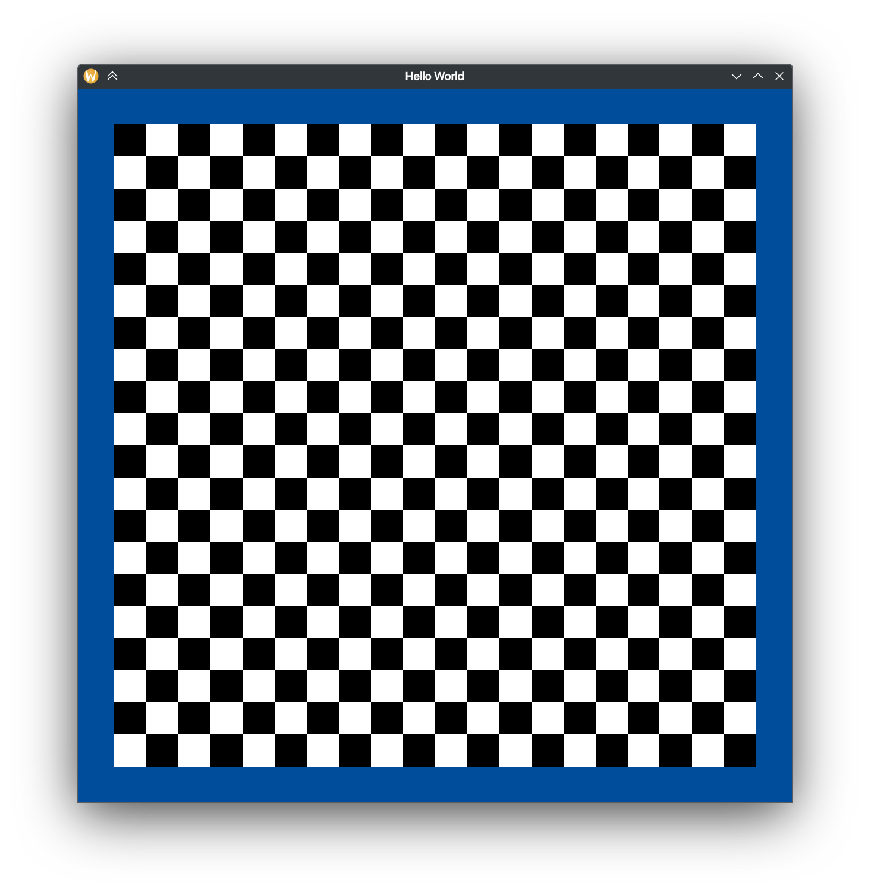
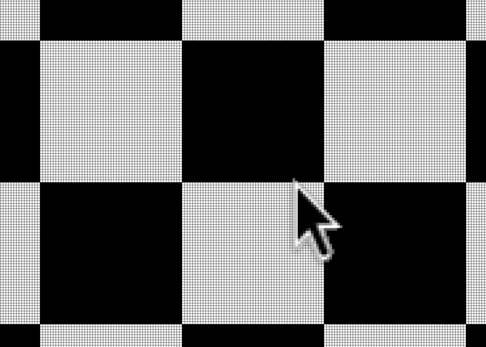
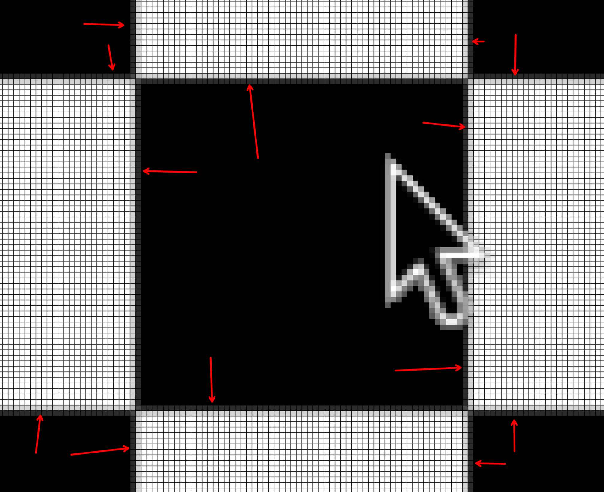

# Wayland EGL example

C++ project that creates a simple window with an EGL context for the Wayland compositor. Among Wayland-specific things,
the program simply draws a checkerboard pattern by initializing vertex buffers, texture and shader.

The project is self-sufficient, requires Wayland dev packages only and provides a set of protocol descriptions
~~stolen~~ borrowed from SDL.

# Used protocols

This example is designed in such a way you can enable/disable used protocols to experiment with by adjusting CMake
configure variables.

- `-DUSE_FRACTIONAL_SCALE_PROTOCOL=ON` enables fractional scaling protocol.
- `-DUSE_VIEWPORTER_PROTOCOL=ON` enables viewporter protocol (required by fractional scaling).
- `-DUSE_DECORATION_PROTOCOL=ON`enables server side decorations protocol.

Most notably, this example demonstrates pixel perfect fractional scaling (still not achieved by GTK and Qt lol)

For demonstration purposes, you can disable fractional scaling by setting `-DUSE_FRACTIONAL_SCALE_PROTOCOL=OFF` to
observe bluriness:

(Screenshots taken on Plasma 6.3.4 with nvidia GPU and 1.5 scale factor)