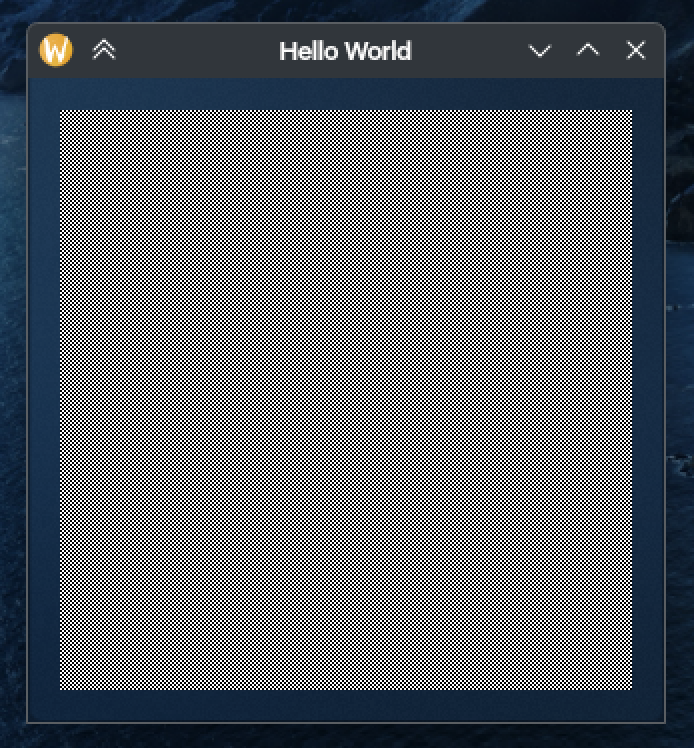
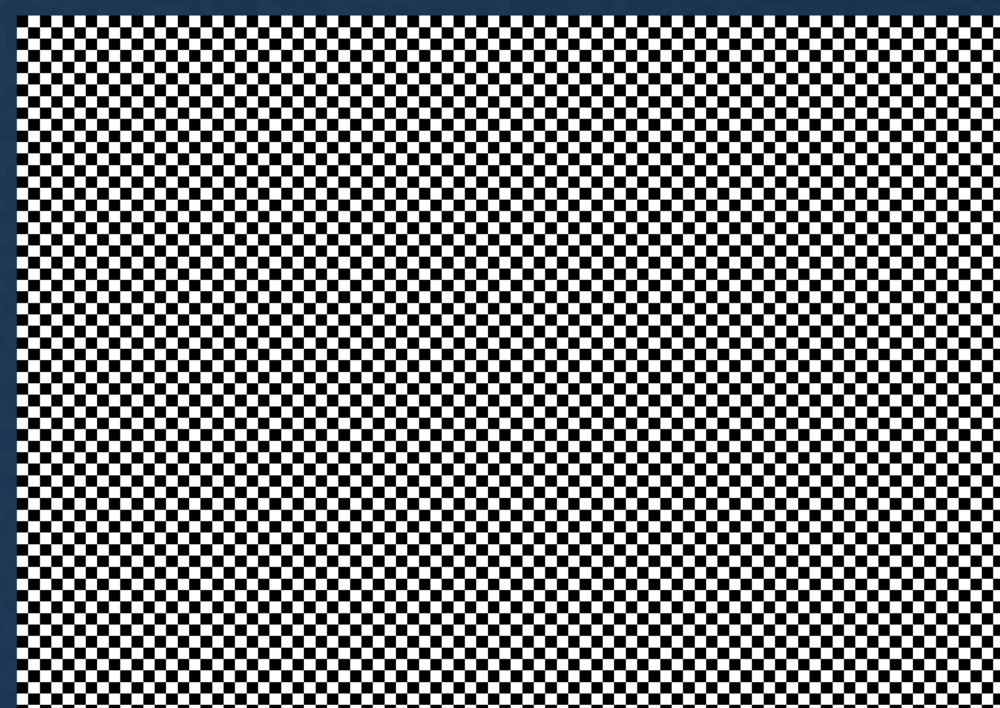
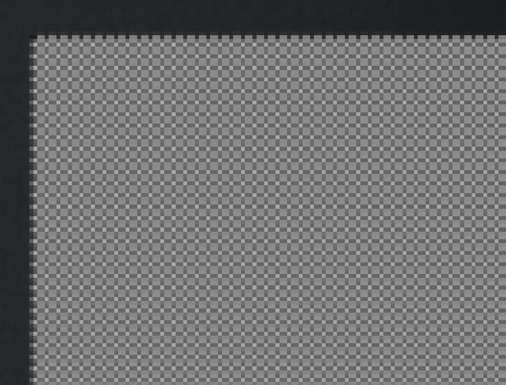

# Wayland EGL example

C++ project that creates a simple window with an EGL context for the Wayland compositor. Among Wayland-specific things,
the program simply draws a perfect checkerboard pattern.

The project is self-sufficient, requires Wayland dev packages only and provides a set of protocol descriptions
~~stolen~~ borrowed from SDL.

# Used protocols

This example is designed in such a way you can enable/disable used protocols to experiment with by adjusting CMake
configure variables.

- `-DUSE_FRACTIONAL_SCALE_PROTOCOL=ON` enables fractional scaling protocol.
- `-DUSE_VIEWPORTER_PROTOCOL=ON` enables viewporter protocol (required by fractional scaling).
- `-DUSE_DECORATION_PROTOCOL=ON`enables server side decorations protocol.

Most notably, this example demonstrates pixel perfect fractional scaling. To check, make a screenshot of the window,
open it in an image editor and zoom in close enough so editor will display pixels. If you see a perfect checkerboard
pattern that remains crisp on the whole surface, congratulations, everything is okay and your system is capable of
displaying fractional scale properly.

If you observe artifacts on the screenshot, it means something screwed up during processing of the application viewport.

Possible causer:

- this program
- compositor
- your screenshot tool

In most cases, if something is wrong, it does not even needed to make a screenshot and scale it.

Most compositors have no problems with displaying integer scaled content. Fractional scaling was tested on this setup:

- Plasma 6.3.4
- Scale factor 1.5
- NVIDIA 570.133
- Screenshot tool: Spectacle (use `Active Window` or `Select Window` to make a screenshot of this window,
  monitor/rectangle options are broken)

For demonstration purposes, you can disable fractional scaling by setting `-DUSE_FRACTIONAL_SCALE_PROTOCOL=OFF` to
observe bluriness on fractional scales.

